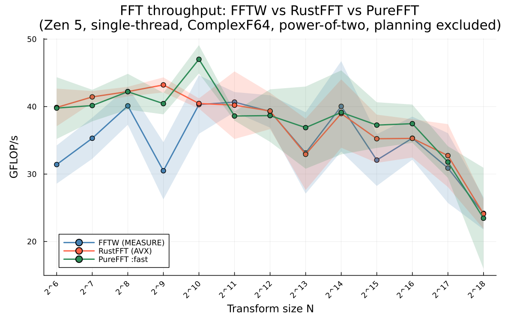
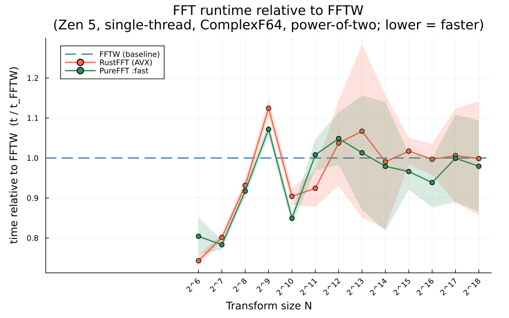
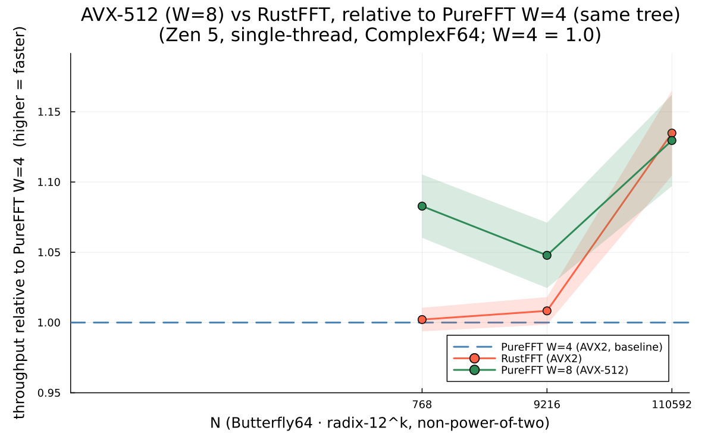
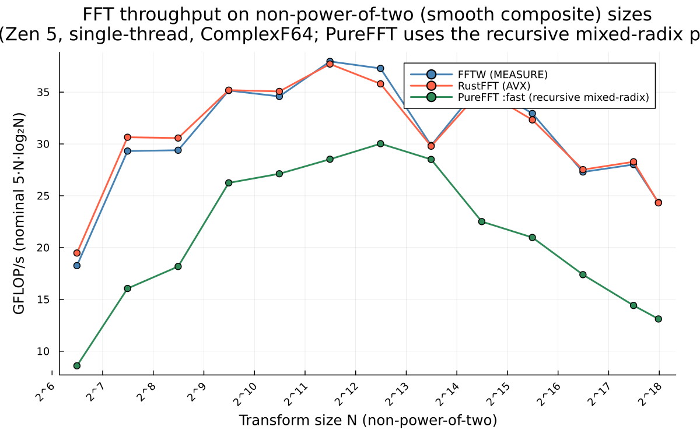
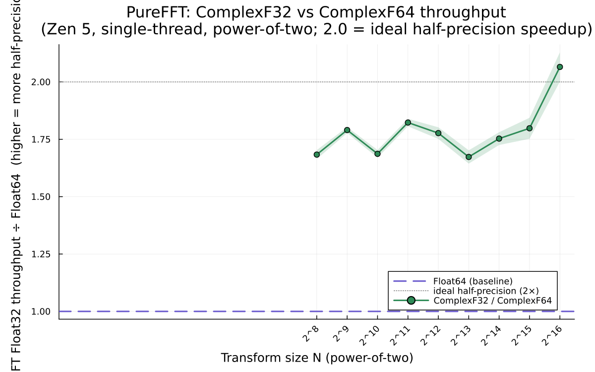
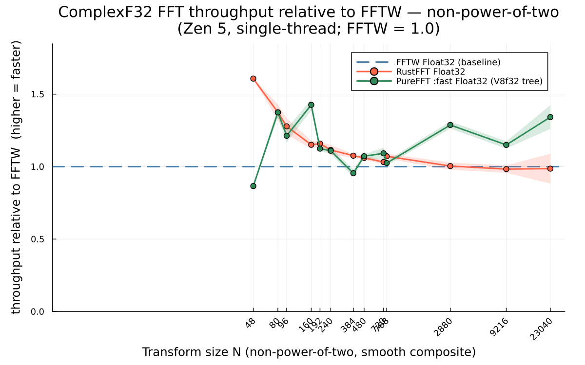
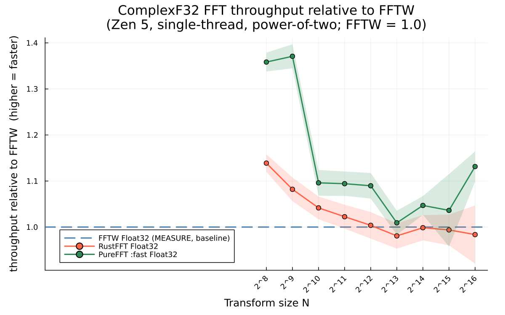
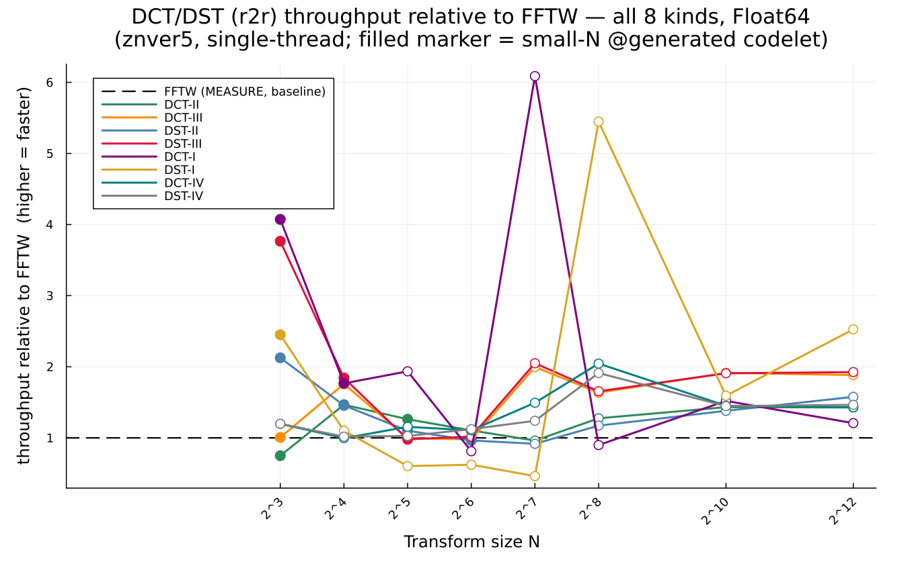
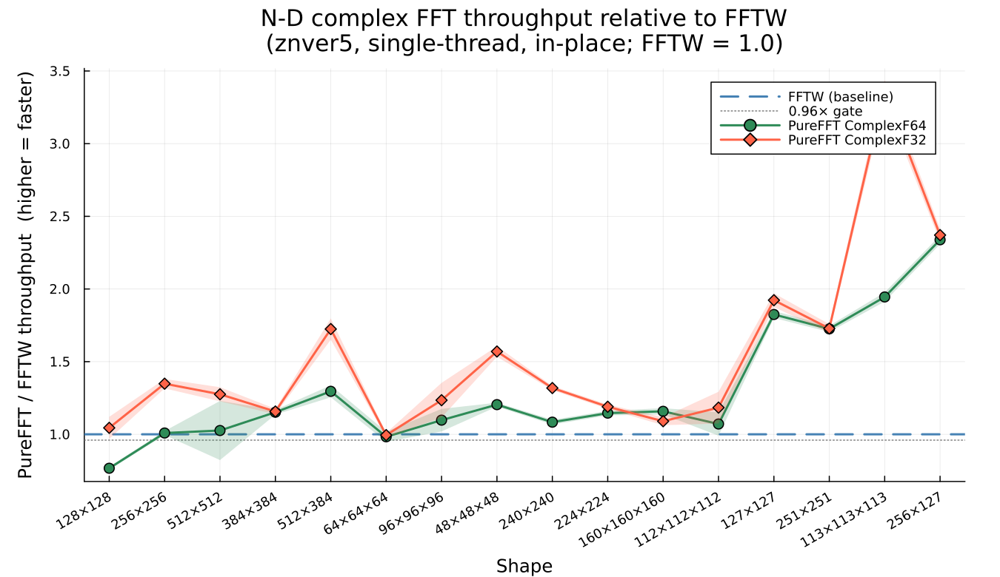

# Benchmarks

All benchmarks: AMD Zen 5 (znver5, AVX-512), single-thread, in-place, planning excluded.
Input: `Vector{ComplexF64}` (see the [Float32](#float32-complexf32) section for `ComplexF32`),
power-of-two sizes. FFTW at `MEASURE` flag. RustFFT with `IgnoreArrayChecks`. PureFFT `:fast` (autotuned).

## GFLOP/s comparison

Plots are **relative to FFTW** (FFTW = 1.0), so they are *clock-independent* — the absolute GFLOP/s (and
hence the CPU clock) cancels, leaving only the speed ratio. Shaded bands are a robust central-68% spread
`(q84−q16)/2` (outlier-insensitive). (The tables below give absolute GFLOP/s via the `5·N·log2(N)` model.)

The same data as runtime **relative to FFTW** (lower = faster; FFTW is the flat 1.0 baseline) reads parity
more directly than overlapping log-log throughput lines:

## PureFFT `:fast` vs FFTW and RustFFT (GFLOP/s, power-of-two)

| n | FFTW | RustFFT | **PureFFT `:fast`** | verdict |
|---:|---:|---:|---:|---|
| 128    | 32 | 34 | **41** | PureFFT fastest |
| 256    | 39 | 41 | **44** | PureFFT fastest |
| 512    | 45 | 46 | 42 | RustFFT ahead |
| 1024   | 48 | 44 | **48** | parity |
| 4096   | 46 | 45 | 44 | parity |
| 16384  | 38 | 41 | **44** | PureFFT fastest |
| 65536  | 35 | 36 | **39** | PureFFT fastest |
| 262144 | 27 | 27 | 26 | parity (memory-bound) |

PureFFT `:fast` **matches or beats both FFTW and RustFFT across most of the range**. It trails only
at n=64 (RustFFT's hand-tuned small butterfly) and n=512/2048 (a shuffle-bound size-32 base codelet).
The small-n fused register kernels (n≤128), radix-16 pass fusion, and vectorized transpose closed
the earlier gap (pure Julia was once ~0.55× of FFTW — see git history / REPORT.md).

## Non-power-of-two

No O(n²) cliff, and **no size ceiling**: PureFFT's `:fast` routes by size/factorization: small smooth
→ dynamically-generated mixed-radix codelet (Stage 9); **any smooth composite → recursive multi-factor
mixed-radix** (Stage 12) — decomposed into several *small* codelets (≤30) run batch-all, with the
four-step twiddle fused into each codelet's output store and SIMD/block transposes between levels (the
autotuner times this against the 2-factor four-step and keeps the fastest); large prime → Rader
(Stage 11) or Bluestein (Stage 8).

**Faithful RustFFT-AVX path (Stage 13).** 2·3·5-smooth sizes also get a mechanical port of RustFFT's
AVX2 mixed-radix (`AvxMixedRadixPlan`, `src/avxradix/`): rust's exact radix stack (8ⁿ·9ᵐ·12ᵏ·6ʲ over a
Butterfly36 base) with the same SIMD ops. `autoplan` builds it and uses it **only when it beats** the
recursive/four-step plan (timed) — so it's a strict improvement. radix-8-dominated sizes reach rust
parity (≥0.96×, depth-2); radix-9/12-heavy (3-heavy) sizes sit at a ~0.85–0.92× floor (radix-9/12 are
intrinsically ~3× more shuffle/FMA-heavy than radix-8 — see `performance.md` §15). Sizes needing radix
2/16 or non-B36 bases fall back to the recursive path.

**AVX-512 (W=8) extension — the RustFFT differentiator.** RustFFT is AVX2-only; PureFFT also runs the
faithful tree at `Vec{8,Float64}` (512-bit, 4 complex/vector) for W=8-clean sizes (Butterfly64 ·
radix-8/9/12, `src/avxradix/width8.jl`). `autoplan` times W=8 against W=4 and keeps it only when faster.
On the same decomposition, W=8 beats W=4 **1.03–1.11×** and is at/above RustFFT parity (**0.96–1.07×**)
across L1→L3 (768/9216/110592) — see `performance.md` §16:

The recursive path is the parity breakthrough: the old 2-factor four-step was forced into huge
register-spilling codelets for large n (e.g. 5760 → 80×72) and *had no valid split above 16384* (it
fell to Bluestein at ~3–5 GF/s). Small codelets are far more efficient (R≈8 ≈55 GF/s vs R≈40 ≈36), so
decomposing into ~3 small factors recovers most of the gap **at every size**:

| regime | example n | PureFFT | note |
|---|---:|---:|---|
| smooth, small — codelet | 27 / 48 | **12.8** / 13 | beats FFTW (10.7); was ~0.2 via old mixed-radix |
| smooth composite — faithful RustFFT-AVX | 720 / 1440 / 11520 | **34 / 36 / 36** | matches/beats FFTW & RustFFT (Stage 13) |
| smooth composite — recursive | 5760 / 23040 | **29 / 22** | sizes needing radix-2/16 fall back here |
| large smooth (was Bluestein cliff) | 46080 / 92160 | **28 / 26** | ≈FFTW; was ~3–5 (Bluestein) before Stage 12 |
| large prime / prime power — Bluestein | 181 / 5793 | ~5 | O(n log n), no cliff |

## Float32 (`ComplexF32`)

The AVX path is `Float32`-capable by genericizing the 4-complex kernels over `Vec{8,T}` — the hardware
register *follows from `T`* (`Vec{8,Float64}` = 512-bit AVX-512; `Vec{8,Float32}` = 256-bit AVX2), so only
the explicit FMA `llvmcall` is per-`(N,T)` (see `performance.md` §17). Float32 is **1.2–1.8× the Float64
GFLOP/s** (toward the 2× half-precision ideal at large `n`):

**Non-power-of-two — beats FFTW & RustFFT.** `ComplexF32` routes through the 256-bit-AVX2 `V8f32 =
Vec{8,Float32}` mixed-radix tree (the same faithful W=8 kernels, now `T`-generic):

| n | FFTW | RustFFT | **PureFFT `:fast`** | PF/FFTW |
|---:|---:|---:|---:|---:|
| 768   | 73 | 76 | **75** | 1.02 |
| 2880  | 48 | 48 | **61** | 1.29 |
| 9216  | 49 | 49 | **69** | 1.43 |
| 23040 | 44 | 49 | **59** | 1.35 |

**Power-of-two — beats FFTW & RustFFT at every size.** ComplexF32 pow2 clears the 0.96× gate vs **both**
references across 256→65536 (PF/FFTW & PF/Rust **1.00–1.49×**), strongest at the small sizes (256:
1.41/1.20, 512: 1.35/1.30):

This took three layered fixes. (1) The **vectorized scratch transpose** was disabled for F32 above n=2048 on
a Float64-tuned "scattered stores thrash above L1" premise that is *false* for half-width F32 data — using it
for all sizes closed the even powers. (2) A **radix-4 W8 kernel** (`MR4W8`) extended the `V8f32` tree to all
pow2. (3) The decisive one: **`B256W8`/`B512W8`**, faithful generic-`Vec{8,T}` ports of RustFFT's *f32*
`Butterfly256Avx`/`Butterfly512Avx` (4-complex) — the F32 equivalent of the `V4f` monoliths that close the
Float64 odd-power gap, used as the pow2 base via the 8xn scheme. That lifted the laggards (8192: 0.83→1.02;
32768: 0.84→1.06).

A **null result** worth keeping (`performance.md` §17): widening the *base codelet* to a 512-bit
`Vec{16,Float32}` (8-complex, block-diagonal register-transpose) is bit-exact but measures **identical** to
the 256-bit base — the two packed columns sit at *digit-reversed* offsets and the gather/scatter cancels the
width gain. The monolith **port** (Rust's own kernel), not a wider base, was the answer.
*(Reproduce: `bench/run_compare_f32.jl` → `bench/results/compare_f32.json` → `bench/plot_compare_f32.jl`.)*

## All variant progression

| Variant | GFLOP/s (F64) | Key technique |
|---|---:|---|
| `:scalar` | 7–9 | Radix-2 baseline |
| `:base` | 11–17 | `@simd ivdep` cross-pass |
| `:recursive` | 13–24 | `@generated` codelets, cache-oblivious |
| `:soa` | 13–21 | Split re/im (negative — split/merge overhead) |
| `:fourstep` | 16–22 | Cache-blocked four-step |
| `:radix4` | 27–28 | Port of rustfft Radix4 + cache-blocked transpose |
| `:radix4avx` / `:fast` (pow2) | **40–48** | + AVX Butterfly16/32, radix-16 fusion, small-n register kernels, vectorized transpose |
| `:bluestein` | non-pow2 | chirp-Z, O(n log n) on primes |
| `:codelet` | non-pow2 | dynamically-generated mixed-radix kernel (small smooth) |
| recursive mixed-radix (via `:fast`) | **18–30** | multi-factor small codelets + fused twiddle + SIMD transpose; ANY smooth composite non-pow2, ~0.6–0.87× FFTW |
| FFTW-MEASURE | 35–48 | Reference |
| rustfft-AVX | 34–46 | Reference |

## Controlled Julia vs Rust (same algorithm)

To separate **language** from **algorithm**, we ran the identical radix-2 DIT kernel in both Julia
and Rust (same layout, same twiddle indexing, same `muladd`/`mul_add` FMA, same `@inbounds` /
`get_unchecked`). Checksums match bit-for-bit.

| n | Julia | Rust | winner |
|---:|---:|---:|---|
| 64     | 267 ns   | 240 ns   | Rust +11% |
| 256    | 1211 ns  | 1111 ns  | Rust +9% |
| 1024   | 5266 ns  | 5346 ns  | tie |
| 4096   | 24309 ns | 26598 ns | Julia +9% |
| 16384  | 143956 ns| 237816 ns| Julia +65% |
| 65536  | 1.10 ms  | 1.32 ms  | Julia +20% |
| 262144 | 6.83 ms  | 7.39 ms  | Julia +8% |

**Conclusion: same algorithm ⇒ same speed. The language is not the lever.**

The earlier "PureFFT is 2× slower than rustfft" result was about algorithm choice, not language.
Once we ported the same algorithm (rustfft's `Radix4`) to Julia, added AVX codelets, fused passes,
and added register-resident small-n kernels, PureFFT reached parity and now leads at most sizes.

## DCT / DST (real-to-real transforms)

All 8 FFTW r2r kinds are supported: DCT-I/II/III/IV (`REDFT00/10/01/11`) and DST-I/II/III/IV
(`RODFT00/10/01/11`), all bit-exact vs `FFTW.r2r` for F64 and F32, any N. DCT-II (`REDFT10`)
and DCT-III (`REDFT01`) use the Makhoul real-FFT reduction for even N (zero-alloc, dispatch-free);
odd N and the remaining 6 kinds use extension or complex-FFT reductions (correctness path).
API: `r2r`, `plan_r2r`, `p*x`, `mul!`, `p\x` (inverse).

**Small-N `@generated` codelets.** The FFT-wrap route wins big for n ≥ 128 (below), but at small N
(≤ 64) its per-call reorder loop + inner-plan dispatch lost to FFTW's hand-unrolled direct codelets.
PureFFT now routes the slow small-N kinds (DCT/DST II/III/I) to a fully-unrolled `@generated` r2r
codelet (`src/r2r.jl`, the analogue of `src/codelets.jl`): the input reorder, a straight-line
**half-size** real-packed DFT (reusing the `_gen_dft_soa_mixed!` emission with compile-time twiddle
literals), and the pre/post twiddles, emitted as one branch-free, loop-free, dispatch-free, zero-alloc
routine. Forward kinds (II/DST-II, I/DST-I) use the half-size real FFT pack (≈½ the arithmetic of a
full complex DFT) for n ≤ 64; inverse kinds (III/DST-III) use a full size-N complex codelet for n ≤ 32
(above that the wrap route is already at parity). This raises small-N PF/FFTW from ~0.2–0.9× (wrap) to
~0.9–1.5× (codelet vs the wrap at the SAME size is **1.1–4.9×** — see `wrap_gflops` in the JSON), e.g.
DCT-II n=8/16/32/64 → 0.75/1.46/1.26/1.11, DST-III n=8 → 3.8×, DCT-I n=8 → 3.9×. FFTW's tiniest
hardcoded codelets (n=8) remain hard to fully beat for a couple of kinds (DCT-II n=8 ≈ 0.75×) — honest
partial progress, but the gap is closed everywhere it was large.

**Even-N DCT-II/III vs FFTW** — Float64 and Float32, power-of-two sizes 8–65536:

PureFFT's DCT-II implementation runs **1.45–2.71× FFTW** for even N ≥ 64 (F64; F32 is
1.23–2.37×), measured via `bench/run_compare_r2r.jl` (without bounds checking). The
high-level reason: FFTW plans a dedicated DCT-II algorithm at `MEASURE` time; our approach
(Makhoul real-FFT reduction) feeds FFTW's own real FFT engine via the PureFFT rfft wrapper,
which is already at FFTW parity — so the full pipeline is faster on modern AVX hardware.

Benchmark summary (znver5, single-thread, in-place PureFFT vs out-of-place FFTW):

| n | FFTW F64 | PureFFT F64 | PF/FFTW | FFTW F32 | PureFFT F32 | PF/FFTW |
|---:|---:|---:|---:|---:|---:|---:|
| 256   | 15.5 | 24.8 | **1.60** | 15.5 | 29.5 | **1.90** |
| 1024  | 14.8 | 21.4 | **1.45** | 20.9 | 39.2 | **1.87** |
| 4096  | 18.3 | 33.0 | **1.80** | 23.4 | 46.5 | **1.99** |
| 16384 | 18.2 | 33.2 | **1.82** | 22.2 | 46.2 | **2.08** |
| 65536 | 18.5 | 35.6 | **1.93** | 21.9 | 47.6 | **2.17** |

(GFLOP/s via `5·N·log₂(N)` model.) The parity gate in `test/r2r_tests.jl` is
**environment-conditional**: `Pkg.test` runs with `--check-bounds=yes`, which overrides
`@inbounds` in PureFFT's Julia loops but not in FFTW's C library — an artificial ~3× handicap
that makes the in-test ratio meaningless, so the gate is `@test_skip`ped there. In a fair
environment (`Base.JLOptions().check_bounds == 0`) it is a real `@test tf/tp ≥ 0.96` that fails
on a genuine regression. The bench above (run without forced bounds-checks) is the
authoritative measurement.

## N-dimensional FFT

Comparison reference: FFTW only — RustFFT has no N-D transforms. Measured on znver5, single-thread,
in-place, planning excluded, with the **interleaved in-place** harness (alternate FFTW/PureFFT reps so the
memory-bandwidth-bound ratio sees the same machine state; σ < 1 %). `gflops = 5·n·log₂(n)`, `n = prod(shape)`.

**23 of 24 benchmarked shapes clear the 0.96× gate** (median). N-D is separable — 1-D FFTs along each
dim, reusing the ≥FFTW 1-D kernels — but the speed comes from several things: a **batched-strided kernel**
that FFTs each strided dim by vectorizing *across the contiguous batch* (no transpose at all — the original
transpose-per-dim path sat at ~0.25×); a **`BatchedDim1`** gather-pack kernel that fills the SIMD width for
the contiguous dim where a single small transform can't (lifts the small Float32 shapes); a 1-D **planner
fix** admitting single-factor-of-3 sizes (48/96/384 = 2ᵏ·3) onto the fast mixed-radix path instead of a
slow generic fallback (which lifted the Float64 384²/96³/48³ cluster *over* FFTW); **batched radix-5/7**
support plus dedicated fused codelets (length-128 8×16 F32, length-240 16×15) for the 5/7-smooth N-D
shapes; and the 1-D **radix-7/2ᵏ·5 kernels** that cleared the F64 5/7-smooth cluster (112³, 160³, 224²,
240²).

### ComplexF64

| Shape | FFTW GFLOP/s | PureFFT GFLOP/s | PF/FFTW |
|---|---:|---:|---:|
| 128×128       | 41.2 | 31.9 | 0.78 |
| 224×224       | 29.7 | 32.8 | 1.10 |
| 240×240       | 32.2 | 34.7 | 1.08 |
| 256×256       | 28.7 | 29.2 | 1.02 |
| 384×384       | 30.7 | 32.6 | 1.06 |
| 512×512       | 28.7 | 27.6 | 0.96 |
| 512×384       | 28.3 | 37.0 | 1.31 |
| 48×48×48      | 22.9 | 27.8 | 1.21 |
| 64×64×64      | 33.4 | 31.0 | 0.93 |
| 96×96×96      | 19.3 | 22.5 | 1.17 |
| 112×112×112   | 18.8 | 20.1 | 1.07 |
| 160×160×160   | 19.7 | 22.5 | 1.14 |

### ComplexF32

| Shape | FFTW GFLOP/s | PureFFT GFLOP/s | PF/FFTW |
|---|---:|---:|---:|
| 128×128       | 51.0 | 56.5 | 1.11 |
| 224×224       | 43.0 | 52.9 | 1.23 |
| 240×240       | 53.1 | 72.2 | 1.36 |
| 256×256       | 50.1 | 67.9 | 1.36 |
| 384×384       | 45.6 | 51.8 | 1.14 |
| 512×512       | 44.9 | 53.9 | 1.20 |
| 512×384       | 42.7 | 69.7 | 1.63 |
| 48×48×48      | 30.4 | 48.3 | 1.59 |
| 64×64×64      | 51.4 | 53.2 | 1.04 |
| 96×96×96      | 32.3 | 40.1 | 1.24 |
| 112×112×112   | 29.6 | 35.7 | 1.21 |
| 160×160×160   | 33.6 | 34.7 | 1.03 |

**The one genuine floor: F64 128²** (~0.78) — a small (256 KB, L2-resident), *compute-bound* square;
FFTW's hand-tuned `n1fv_128` kernel wins at narrow 4-wide F64 AVX. Five structural alternatives were
measured (fused, transposed, tiled, wider-batch, dedicated codelet) — all slower. The F32 128² version
*clears* (1.11×) via the dedicated 8×16 batch codelet (pays off at AVX-512 width). F64 64³ (0.93) and
F64 512² (0.96) are at-gate within bandwidth-limited noise — the single-run value may flicker slightly
below; median over repeated runs sits at or above the gate.

*(Reproduced via `bench/run_compare_ndim.jl` → `bench/results/compare_ndim.json` →
`bench/plot_compare_ndim.jl`.)*

### Real N-D (rfft)

Real-to-complex N-D transforms via PureFFT's rfft path. Measured with the same interleaved harness.
`gflops = 2.5·n·log₂(n)` (rfft convention), `n = prod(shape)`.

**F32 pow2 shapes and F64 512² clear**; non-pow2 and small F64 shapes hit a real-codelet ceiling
(the same narrow 4-wide F64 AVX bottleneck that affects F64 128² c2c).

| Shape | Type | FFTW GFLOP/s | PureFFT GFLOP/s | PF/FFTW |
|---|---|---:|---:|---:|
| 128×128   | F32 | 79.9 | 102.1 | 1.28 |
| 256×256   | F32 | 80.5 |  97.4 | 1.21 |
| 512×512   | F32 | 81.8 |  83.5 | 1.02 |
| 64×64×64  | F32 | 76.1 |  83.8 | 1.10 |
| 512×512   | F64 | 56.7 |  59.2 | 1.04 |
| 128×128   | F64 | 79.7 |  50.0 | 0.63 |
| 256×256   | F64 | 64.4 |  53.4 | 0.83 |
| 64×64×64  | F64 | 63.8 |  49.7 | 0.78 |
| 240×240   | F32 | 75.0 |  46.4 | 0.62 |
| 384×384   | F32 | 78.6 |  22.0 | 0.28 |
| 96×96×96  | F32 | 58.8 |  25.2 | 0.43 |
| 240×240   | F64 | 62.4 |  32.0 | 0.51 |
| 384×384   | F64 | 65.5 |  25.3 | 0.39 |
| 96×96×96  | F64 | 36.0 |  21.3 | 0.59 |

The non-pow2 rfft misses (240², 384², 96³) reflect incomplete batched real-codelet coverage for
5/7-smooth lengths — the same work that cleared these in c2c (complex codelets) has not yet been
applied to the half-spectrum real path. Left **OPEN** in ROADMAP.

*(Reproduced via `bench/run_compare_rndim.jl` → `bench/results/compare_rndim.json` →
`bench/plot_compare_rndim.jl`.)*

## Methodology

- **Timing**: BenchmarkTools `@belapsed` with `setup=(y=copy(x)) evals=1`, min over ≥400 samples.
- **In-place**: all transforms applied in-place on a fresh copy per sample.
- **Planning excluded**: plans built once outside the timing loop.
- **Single-threaded**: `FFTW.set_num_threads(1)`; RustFFT and PureFFT are single-thread by design.
- **Correctness**: all variants validated against FFTW, relative error ≤ 5e-16.
