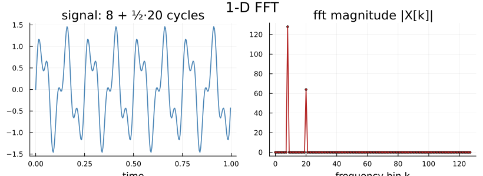
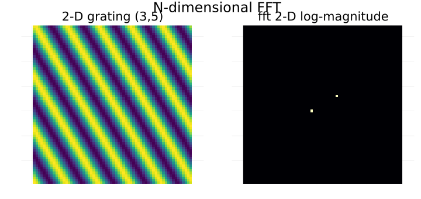
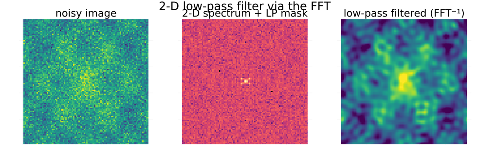
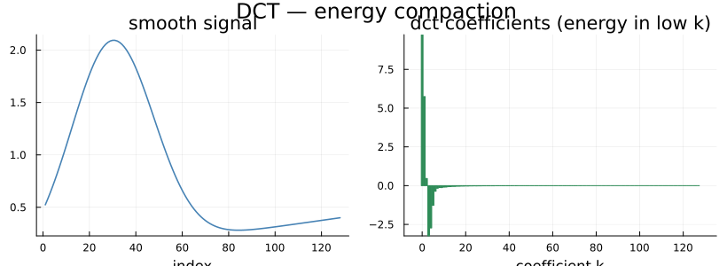

# API Guide

PureFFT is a from-scratch, pure-Julia FFT library that matches or beats FFTW and RustFFT across
power-of-two and non-power-of-two sizes, with no binary dependency. It provides:

- **Complex FFTs** — 1-D and N-dimensional, `Float64` and `Float32`.
- **Real-input FFTs** — `rfft`/`irfft`, 1-D and N-dimensional.
- **Real-to-real transforms** — all eight FFTW DCT/DST kinds.
- A native API (`pfft`/`r2r`/…) **and** full `AbstractFFTs.jl` integration (`fft`/`plan_fft`/`mul!`/`\`).

---

## Tutorial

### Installing and loading

```julia
using PureFFT
```

`using PureFFT` brings the native API (`pfft`, `r2r`, `dct`, the `REDFT*`/`RODFT*` kind constants, …)
into scope. To use the generic `fft`/`ifft`/`rfft` names, also load `AbstractFFTs` (PureFFT registers
itself as a provider):

```julia
using AbstractFFTs, PureFFT
```

> If FFTW.jl is loaded in the same session, its methods are *more specific* for concrete `Array`s and
> win dispatch for `fft(::Array)` — call `PureFFT.pfft(...)` (or don't load FFTW) to force PureFFT.

### Your first transform (1-D complex)

```julia
x = randn(ComplexF64, 4096)
y = pfft(x)          # allocating forward FFT (unnormalized, like FFTW)
z = ipfft(y) ./ 4096 # inverse, normalized back to x
@assert maximum(abs, z .- x) < 1e-12
```

For repeated transforms, build a **plan once** and apply it in place (zero allocations on the hot path):

```julia
buf  = randn(ComplexF64, 4096)
plan = plan_pfft(buf)        # :fast variant, autotuned at first use
pfft!(buf, plan)             # forward, in place
ipfft!(buf, plan)            # inverse, in place — the same plan does both
```

A two-tone signal and the magnitude spectrum `pfft` recovers (peaks at bins 8 and 20):



### N-dimensional FFTs

Any rank, any subset of dimensions. Use the `AbstractFFTs` names, or the prefixed `pfft(array, dims)`:

```julia
using AbstractFFTs, PureFFT

A = randn(ComplexF64, 256, 256)
F = fft(A)                  # transform all dims (drop-in for FFTW.fft)
F2 = fft(A, 2)              # only dim 2
A2 = ifft(F)                # inverse
@assert maximum(abs, A2 .- A) < 1e-10

V = randn(ComplexF64, 64, 64, 64)
G = pfft(V, (1, 3))         # prefixed form; transform dims 1 and 3 only
```

Plan-based / in-place N-D:

```julia
A = randn(ComplexF64, 384, 384)
p = plan_fft(A)             # an NDPlan
Y = similar(A)
mul!(Y, p, A)               # in place into Y
X = inv(p) * (p * A)        # round-trips back to A (normalization handled)
```

A 2-D sinusoidal grating and its 2-D spectrum (the two bright dots are the grating's frequency):



#### A worked 2-D example: low-pass filtering an image

The classic 2-D FFT use case — forward-transform, zero the high frequencies, inverse-transform — smooths
an image:

```julia
using PureFFT, AbstractFFTs            # AbstractFFTs supplies fftshift / ifft
n = 96
img = [exp(-(x^2+y^2)/4) + 0.5cos(2x)cos(3y) for x in range(-3,3,n), y in range(-3,3,n)] .+ 0.6 .* randn(n,n)

F   = pfft(ComplexF64.(img), (1, 2))                 # 2-D FFT
cen = fftshift(F)                                    # zero frequency to the centre
c, r = n÷2 + 1, n÷6
mask = [hypot(i-c, j-c) <= r for i in 1:n, j in 1:n] # circular low-pass mask
smooth = real.(ifft(ifftshift(cen .* mask)))         # mask the spectrum, inverse-transform
```

`smooth` keeps only the low-frequency structure — the noise (high frequencies) is gone:



### Real-input FFTs

A length-`n` real signal has a Hermitian spectrum, so `rfft` returns the non-redundant half
(`n÷2+1` complex values). 1-D, native names:

```julia
s = randn(512)              # real
S = prfft(s)                # length 257 complex half-spectrum
r = pirfft(S, 512)          # back to length-512 real (needs the original length)
@assert maximum(abs, r .- s) < 1e-12
```

or via `AbstractFFTs` (1-D and N-D):

```julia
using AbstractFFTs, PureFFT
img = randn(256, 256)       # real 2-D
R   = rfft(img)             # 129×256 complex half-spectrum (halved along dim 1)
img2 = irfft(R, 256)        # back to 256×256 real (give the original first-dim length)
```

> `prfft` requires an **even** length (the r2c dimension). Odd lengths throw an `ArgumentError`.

### DCT / DST (real-to-real)

All eight FFTW r2r kinds are available, named exactly as FFTW names them. The high-level
**orthonormal** DCT (the "the DCT" most people mean) is `dct`/`idct`:

```julia
v = randn(1024)
c = dct(v)                  # orthonormal DCT-II (scipy norm="ortho" / FFTW.jl dct)
w = idct(c)                 # inverse
@assert maximum(abs, w .- v) < 1e-12
```

The DCT concentrates a smooth signal's energy into the first few coefficients (why it's the basis of
JPEG/MP3 compression):



For the raw, **unnormalized** FFTW transforms, use `r2r(x, kind)` with a kind constant:

```julia
y  = r2r(v, REDFT10)        # DCT-II (unnormalized)
y2 = r2r(y, REDFT01)        # DCT-III == 2N · v   (REDFT01∘REDFT10 = 2N·I)
@assert maximum(abs, y2 ./ (2*length(v)) .- v) < 1e-12

q  = r2r(v, REDFT11)        # DCT-IV (self-inverse up to 2N)
s  = r2r(v, RODFT10)        # DST-II ; r2r(., RODFT01) is its inverse
```

The eight kinds and their FFTW names:

| constant | transform | constant | transform |
|---|---|---|---|
| `REDFT00` | DCT-I  | `RODFT00` | DST-I  |
| `REDFT10` | DCT-II | `RODFT10` | DST-II |
| `REDFT01` | DCT-III | `RODFT01` | DST-III |
| `REDFT11` | DCT-IV | `RODFT11` | DST-IV |

### Throw-free error handling

Every plan/transform constructor has a `try…` variant that returns an `ErrorTypes.Result` instead of
throwing — handy in hot or fallible paths:

```julia
using ErrorTypes
r = tryplan_r2r(v, REDFT10)          # Result{R2RPlan, R2RError}
p = is_error(r) ? error("nope") : unwrap(r)
```

---

## Reference

### 1-D complex FFT

| function | description |
|---|---|
| `plan_pfft(x; variant=:fast)` | Build a reusable plan for length-`length(x)` transforms. Planning is cheap; `:fast` autotunes at first use. |
| `pfft(x; variant=:fast)` | Allocating forward FFT (unnormalized). |
| `pfft!(x, plan)` | In-place forward FFT. Zero-alloc hot path (AllocCheck-verified). |
| `ipfft(x; variant=:fast)` | Allocating inverse (unnormalized — divide by `n` for the normalized form). |
| `ipfft!(x, plan)` | In-place inverse. The plan from `plan_pfft` does both directions. |

Works for `ComplexF64` and `ComplexF32`, any length (power-of-two, smooth non-pow2, and primes — see
[Variants](#variants)).

### N-dimensional FFT

Via `AbstractFFTs` (load `AbstractFFTs, PureFFT`): `fft`/`ifft`/`bfft` and `plan_fft`/`plan_fft!`/
`plan_bfft` accept an `AbstractArray{<:Complex}` of any rank and a `region` (an `Int`, tuple, range, or
`:`) selecting which dimensions to transform — full FFTW generality. `mul!`, `\`, `inv`, and
`AbstractFFTs.normalization` all work. The prefixed `pfft(x::AbstractArray, dims=1:ndims(x))` is the
always-PureFFT form. N-D is **separable** (1-D transforms along each chosen dim) but fast: strided dims
are FFT'd by vectorizing across the contiguous batch (no transpose), and the contiguous dim uses the
1-D kernels directly. Hot path is dispatch-free + zero-alloc.

### Real FFT

| function | description |
|---|---|
| `plan_prfft(x)` / `plan_prfft(T, n)` | Plan a 1-D real→half-complex FFT (`n` **even**). |
| `prfft(x)` | Real→complex; returns the length-`n÷2+1` Hermitian half-spectrum. |
| `plan_pirfft(...)` / `pirfft(X, n)` | Inverse; `n` is the original real length (not recoverable from the half-spectrum alone). |

N-dimensional real FFTs go through `AbstractFFTs`: `rfft(x::AbstractArray{<:Real}, region)`,
`plan_rfft`, `irfft(X, d, region)`, `brfft`. The r2c runs along `first(region)` (halved dim, FFTW
convention) then complex FFTs along the rest.

### DCT / DST (real-to-real)

| function | description |
|---|---|
| `r2r(x, kind)` / `plan_r2r(x, kind)` | Unnormalized FFTW r2r transform / its plan, for any of the 8 `kind` constants. |
| `dct(x)` / `idct(x)` | Orthonormal DCT-II / its inverse (FFTW.jl / scipy `norm="ortho"` drop-in). |
| `plan_dct` / `plan_idct` | Plans for the above (the orthonormal scale is applied by `dct`/`idct`). |
| `tryr2r` / `tryplan_r2r` | `Result`-returning (throw-free) variants. |
| `inv(p)` / `p \ x` | Inverse of an r2r plan (self-inverse kinds scale by their FFTW factor; II↔III pairs invert to each other). |

Kind constants: `REDFT00 REDFT01 REDFT10 REDFT11 RODFT00 RODFT01 RODFT10 RODFT11`. Bit-exact vs
`FFTW.r2r` for `Float64`/`Float32`, any `N`; small `N` uses fully-unrolled `@generated` codelets.

### Variants

The `variant` keyword on `plan_pfft`/`pfft` forces a specific 1-D complex algorithm. `:fast` (the
default) autotunes and is recommended; the rest are mostly for benchmarking/inspection.

| Variant | Description |
|---|---|
| `:scalar` | Plain radix-2 DIT, no SIMD annotations. Baseline. |
| `:mixedradix` | Mixed-radix Cooley-Tukey for any N (primes via DFT fallback). |
| `:base` | Radix-2 with `@simd ivdep` across the cross-pass loop. |
| `:recursive` | Cache-oblivious recursive decomposition with `@generated` base codelets. |
| `:soa` | Split-of-array: separate `re`/`im`, shuffle-free combine. |
| `:fourstep` | Cache-blocked four-step: best for medium/large N. |
| `:radix4` | Port of rustfft's `Radix4`: bit-reversed transpose + log₄ Butterfly4 cross-passes. |
| `:radix4avx` | `:radix4` + explicit SIMD AVX butterflies + radix-16 pass fusion + register-resident kernels for n ≤ 128. The pow2 `:fast` winner. |
| `:bluestein` | Chirp-Z: any N as a smooth convolution, O(n log n) (no prime cliff; the convolution size is the cheapest smooth M ≥ 2n−1). |
| `:codelet` | Dynamically `@generated` mixed-radix straight-line kernel (best for small smooth N). |
| `:fast` | Autotuned, recommended. Power-of-two times radix4avx/recursive/four-step; non-power-of-two routes through the faithful AVX mixed-radix (radix-8/9/12/6/5/7/13 + B-leaves), Rader for smooth-`p−1` primes, or Bluestein. |

### AbstractFFTs integration

PureFFT registers with `AbstractFFTs.jl`, so the standard generic interface dispatches to it (when a
more-specific provider like FFTW isn't loaded):

```julia
using AbstractFFTs, PureFFT, LinearAlgebra

x = randn(ComplexF64, 512)
p = plan_fft(x)             # 1-D
y = p * x
mul!(similar(x), p, x)

A = randn(ComplexF64, 128, 96, 64)
P = plan_fft(A, (1, 3))     # N-D over dims 1 and 3
B = P * A
A ≈ inv(P) * B              # true (normalization handled)
```
